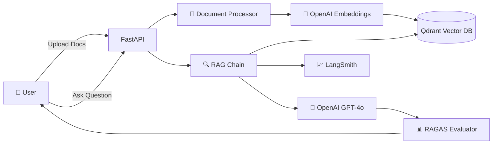

# 🤖 RAG Q&A System

### Production-Ready Retrieval-Augmented Generation with FastAPI & LangChain

## 📖 Overview

A **production-ready** RAG (Retrieval-Augmented Generation) system that enables intelligent Q&A over your documents. Built with modern AI stack and battle-tested in production environments.

### 🎯 What is RAG?

RAG combines the power of **retrieval** (finding relevant information) with **generation** (creating coherent answers) to provide accurate, context-aware responses to your questions based on your own documents.

### 🌟 Key Highlights

- 🚀 **Production Ready**: Docker + CI/CD + AWS deployment
- 🧠 **Smart AI**: Powered by OpenAI GPT-4o & LangChain
- 📊 **Observable**: LangSmith integration for full tracing
- ✅ **Evaluated**: RAGAS metrics for answer quality
- 🔒 **Secure**: Non-root Docker, API validation, error handling
- ⚡ **Fast**: Async operations, streaming responses
- 📈 **Scalable**: Cloud-native architecture

---

