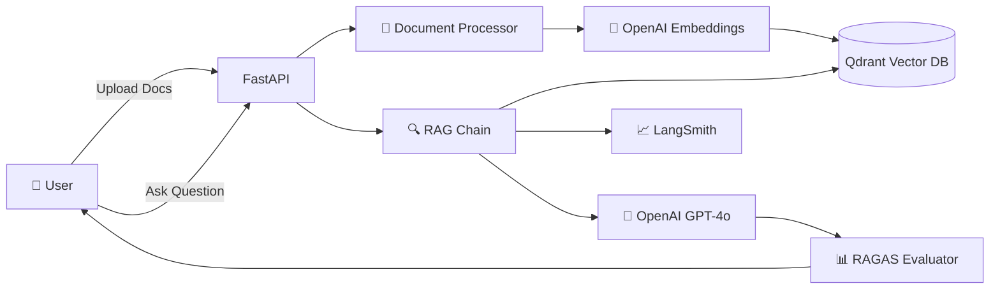

```mermaid
graph LR
    A[👤 User] -->|Upload Docs| B[FastAPI]
    A -->|Ask Question| B
    B --> C[📝 Document Processor]
    C --> D[🔢 OpenAI Embeddings]
    D --> E[(Qdrant Vector DB)]
    B --> F[🔍 RAG Chain]
    F --> E
    F --> G[🤖 OpenAI GPT-4o]
    G --> H[📊 RAGAS Evaluator]
    F --> I[📈 LangSmith]
    H --> A
```